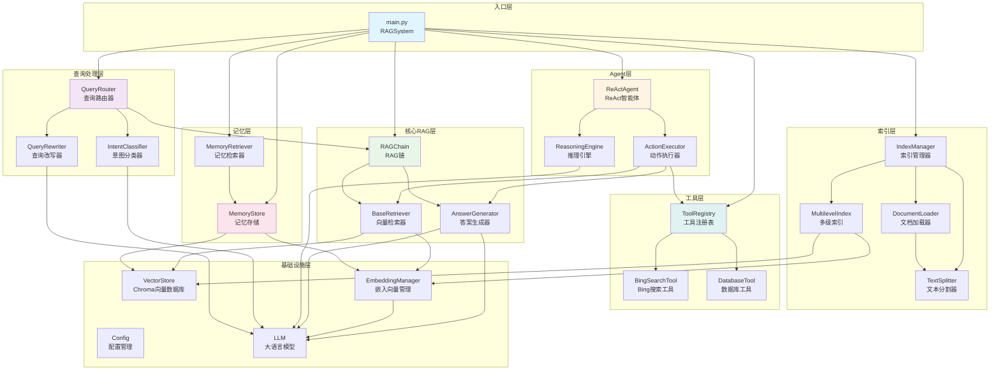
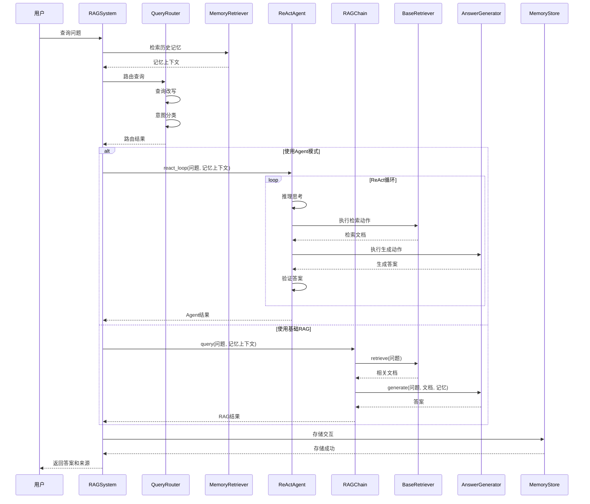
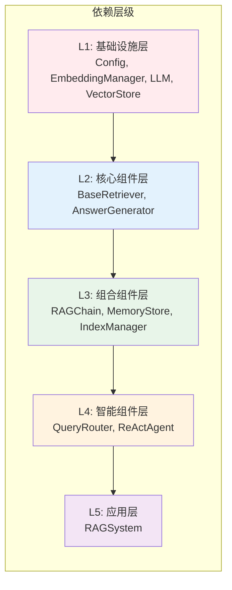

# RAG 系统架构文档

## 系统架构图



## 数据流图



## 模块说明

### 1. 入口层 (main.py)
- **RAGSystem**: 系统主类，负责初始化所有组件并协调工作流程
- 支持两种模式：查询模式和索引构建模式

### 2. 查询处理层 (src/query/)
- **QueryRouter**: 根据查询意图路由到不同的处理策略
- **IntentClassifier**: 使用LLM对查询进行意图分类（事实查询、复杂推理、工具调用、对话）
- **QueryRewriter**: 查询改写，支持扩展和简化查询

### 3. Agent层 (src/agent/)
- **ReActAgent**: 实现ReAct（Reasoning + Acting）循环
  - 思考阶段：推理和规划下一步动作
  - 行动阶段：执行检索、工具调用或生成答案
  - 观察阶段：评估结果并决定是否继续迭代
- **ReasoningEngine**: 负责推理和答案验证
- **ActionExecutor**: 执行具体的动作（检索、生成、工具调用）

### 4. 核心RAG层 (src/core/)
- **RAGChain**: 组装检索和生成流程
- **BaseRetriever**: 向量检索器，支持MMR和重排序
- **AnswerGenerator**: 基于LLM的答案生成器

### 5. 索引层 (src/indexing/)
- **IndexManager**: 管理索引的创建、更新、删除
- **MultilevelIndex**: 多级索引（主题/摘要、文档块、句子级别）
- **DocumentLoader**: 加载各种格式的文档
- **TextSplitter**: 文本分割，支持不同粒度的分块

### 6. 记忆层 (src/memory/)
- **MemoryStore**: 使用Chroma存储历史交互摘要
- **MemoryRetriever**: 检索相关历史记忆，支持时间衰减

### 7. 工具层 (src/tools/)
- **ToolRegistry**: 工具注册表，管理所有可用工具
- **BingSearchTool**: Bing搜索工具
- **DatabaseTool**: 数据库查询工具

### 8. 基础设施层 (src/utils/)
- **Config**: 配置管理
- **EmbeddingManager**: 嵌入向量管理
- **VectorStore**: Chroma向量数据库
- **LLM**: 大语言模型（OpenAI）

## 工作流程

### 查询流程
1. **记忆检索**: 从历史交互中检索相关记忆
2. **查询路由**: 改写查询并分类意图
3. **策略选择**: 根据意图选择处理策略（Agent或基础RAG）
4. **执行查询**: 
   - Agent模式：ReAct循环，多步推理和检索
   - 基础RAG模式：单次检索和生成
5. **存储记忆**: 将交互结果存储到记忆库

### 索引构建流程
1. **文档加载**: 使用DocumentLoader加载文档
2. **文档清理**: 清理和预处理文档
3. **文本分割**: 使用TextSplitter分割文档
4. **索引创建**: 使用IndexManager创建向量索引
5. **元数据保存**: 保存索引元数据信息

## 模块依赖关系图



## 详细模块依赖表

| 模块 | 依赖的模块 | 说明 |
|------|-----------|------|
| **RAGSystem** | QueryRouter, ReActAgent, RAGChain, MemoryStore, MemoryRetriever, ToolRegistry, IndexManager | 系统入口，协调所有组件 |
| **QueryRouter** | IntentClassifier, QueryRewriter, RAGChain | 查询路由，依赖意图分类和改写 |
| **ReActAgent** | ReasoningEngine, ActionExecutor | Agent核心，依赖推理和执行器 |
| **ActionExecutor** | BaseRetriever, AnswerGenerator, ToolRegistry | 动作执行，依赖检索、生成和工具 |
| **RAGChain** | BaseRetriever, AnswerGenerator | RAG链，组合检索和生成 |
| **BaseRetriever** | EmbeddingManager, VectorStore | 检索器，依赖嵌入和向量库 |
| **AnswerGenerator** | LLM, Config | 生成器，依赖大语言模型 |
| **MemoryStore** | EmbeddingManager, VectorStore, LLM | 记忆存储，依赖嵌入、向量库和LLM |
| **MemoryRetriever** | MemoryStore | 记忆检索，依赖记忆存储 |
| **IndexManager** | EmbeddingManager, DocumentLoader, TextSplitter, MultilevelIndex | 索引管理，依赖多个索引组件 |
| **MultilevelIndex** | EmbeddingManager, TextSplitter, VectorStore | 多级索引，依赖嵌入和分割器 |
| **IntentClassifier** | LLM, Config | 意图分类，依赖LLM |
| **QueryRewriter** | LLM, Config | 查询改写，依赖LLM |
| **ReasoningEngine** | LLM, Config | 推理引擎，依赖LLM |
| **ToolRegistry** | BaseTool (抽象基类) | 工具注册表，管理工具 |
| **BingSearchTool** | Config | Bing搜索工具 |
| **DatabaseTool** | Config | 数据库工具 |

## 关键特性

1. **智能路由**: 根据查询意图自动选择最佳处理策略
2. **多级索引**: 支持不同粒度的索引，提高检索精度
3. **记忆机制**: 支持对话上下文和历史记忆
4. **ReAct Agent**: 支持多步推理和工具调用
5. **二次检索**: 当置信度低时自动扩大检索范围
6. **答案验证**: Agent模式下验证答案一致性

## 文件结构说明

```
rag/
├── main.py                    # 系统入口，RAGSystem类
├── config/
│   └── config.yaml            # 配置文件
├── src/
│   ├── agent/                 # Agent层
│   │   ├── react_agent.py     # ReAct智能体
│   │   ├── action_executor.py # 动作执行器
│   │   └── reasoning.py        # 推理引擎
│   ├── core/                  # 核心RAG层
│   │   ├── rag_chain.py       # RAG链
│   │   ├── retriever.py       # 向量检索器
│   │   └── generator.py       # 答案生成器
│   ├── query/                 # 查询处理层
│   │   ├── query_router.py    # 查询路由器
│   │   ├── intent_classifier.py # 意图分类器
│   │   └── query_rewriter.py  # 查询改写器
│   ├── indexing/              # 索引层
│   │   ├── index_manager.py   # 索引管理器
│   │   ├── multilevel_index.py # 多级索引
│   │   ├── document_loader.py # 文档加载器
│   │   └── text_splitter.py   # 文本分割器
│   ├── memory/                # 记忆层
│   │   ├── memory_store.py   # 记忆存储
│   │   └── memory_retriever.py # 记忆检索器
│   ├── tools/                 # 工具层
│   │   ├── tool_registry.py  # 工具注册表
│   │   ├── search_tool.py    # 搜索工具
│   │   └── db_tool.py        # 数据库工具
│   └── utils/                 # 工具层
│       ├── config.py          # 配置管理
│       └── embeddings.py      # 嵌入向量管理
└── data/                      # 数据目录
    ├── raw/                   # 原始数据
    ├── processed/             # 处理后数据
    └── test_set.json          # 测试集
```

